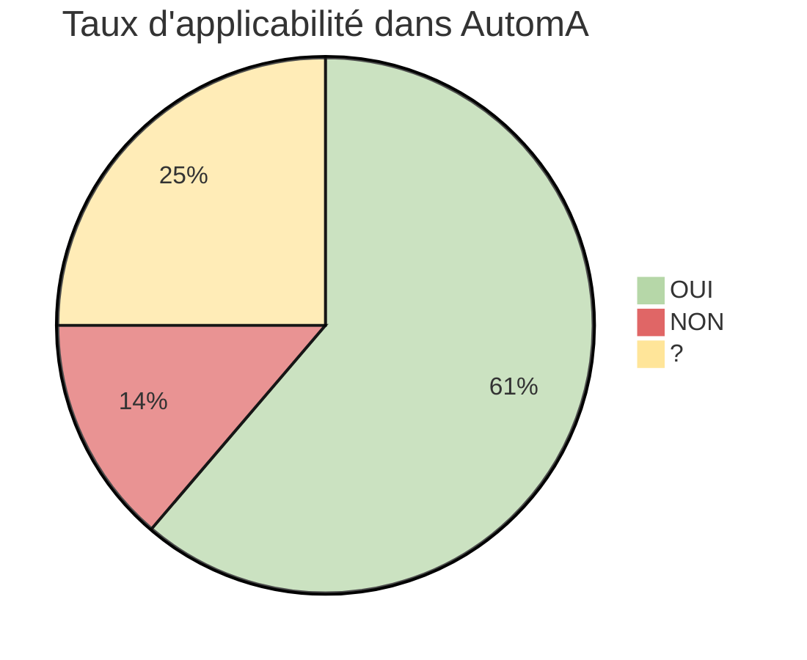
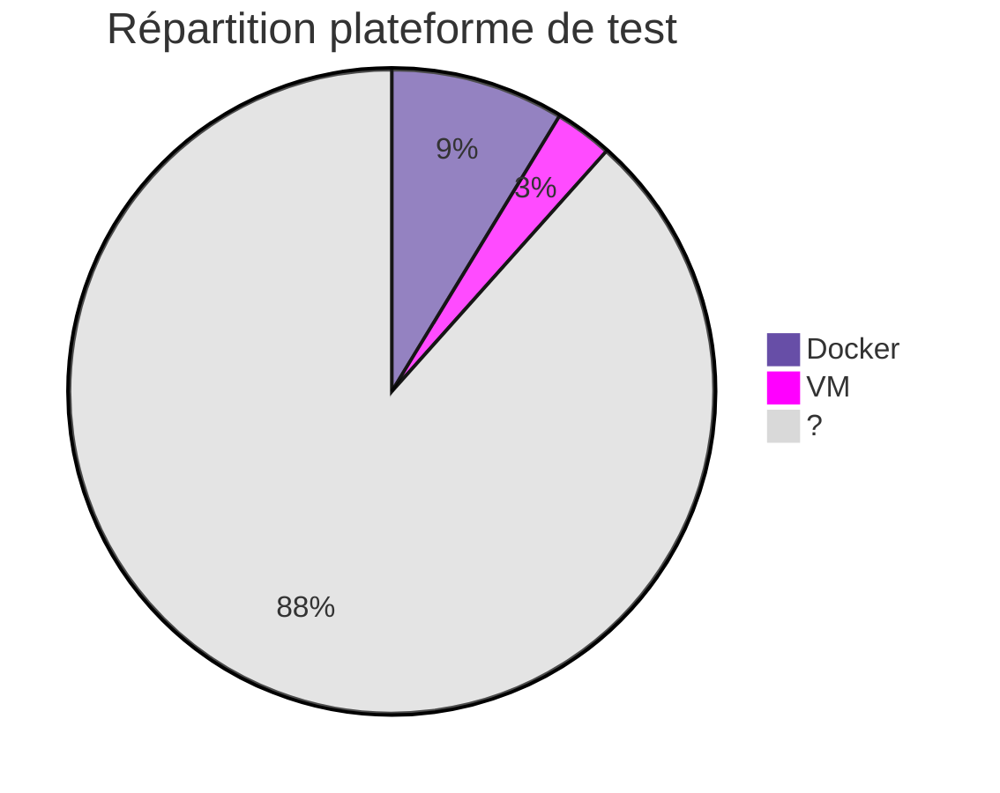

> Dernière mise à jour : 8 décembre 2023

## Debian 12

### Applicabilité

Vous trouverez ci-dessous la liste des règles non-applicables :

|Numéro|Niveau|Nom|
|:---:|:---:|---|
|R1|Renforcé|Choisir et configurer son matériel|
|R2|Intermédiaire|Configurer le BIOS/UEFI|
|R3|Intermédiaire|Activer le démarrage sécurisé UEFI|
|R4|Elevé|Remplacer les clés préchargées|
|R28|Intermédiaire|Partitionnement type|
|R64|Renforcé|Configurer les privilèges des services|
|R65|Renforcé|Cloisonner les services|
|R66|Elevé|Durcir les composants de cloisonnement|
|R76|Elevé|Sceller et vérifier l'intégrité des fichiers|
|R77|Elevé|Protéger la base de données des scellés|
|R78|Renforcé|Cloissoner les services réseau|

### Plateforme de test

### Couverture

## Fichiers

Vous trouverez l'ensemble des fichiers qui contiennent les données présentées.

{}
- [anssi.debian.12.json](/files/anssi.debian.12.json)
{}