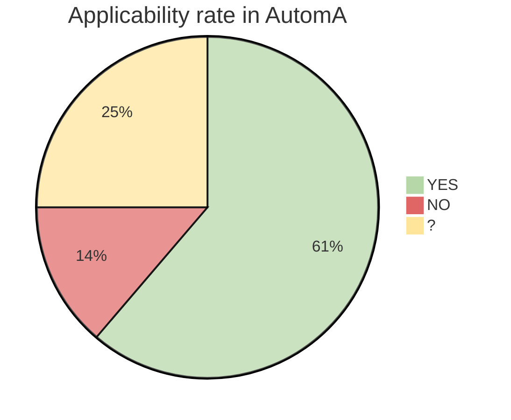
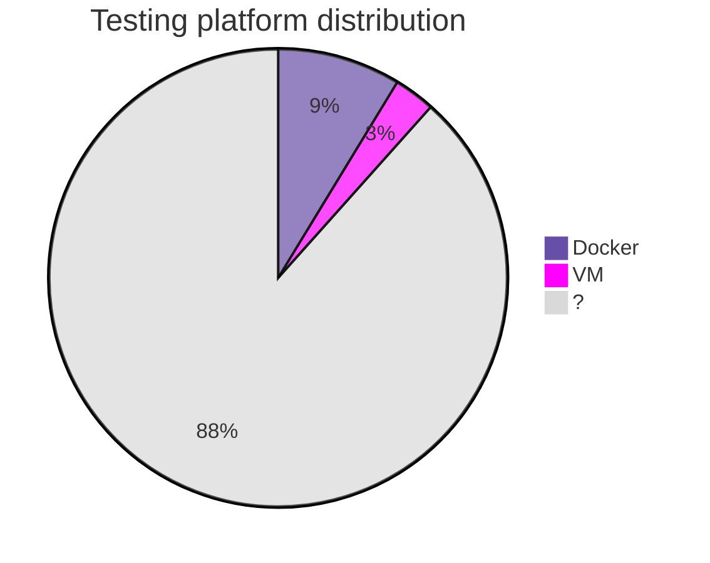
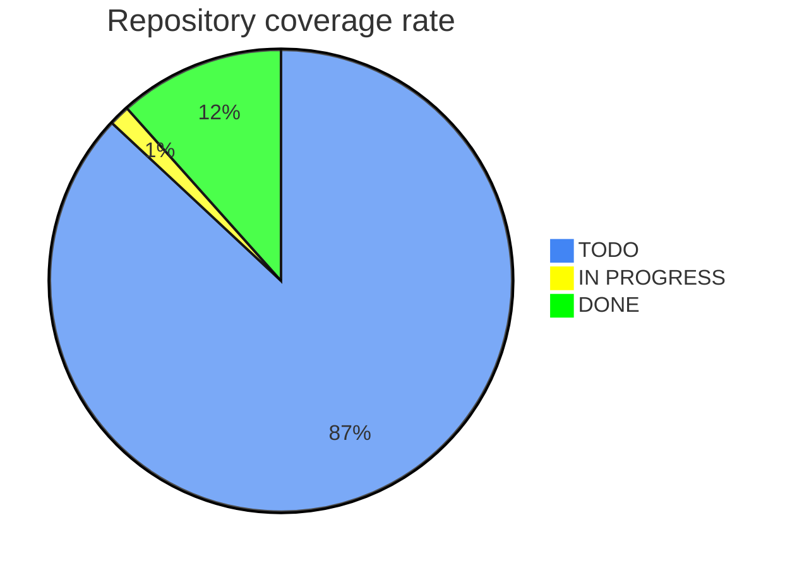

> last update : December 8, 2023

## Debian 12

### Applicability

Below is a list of non-applicable rules:

|Number|Level|Name|
|:---:|:---:|---|
|R1|Reinforced|Choosing and configuring your equipment|
|R2|Intermediate|Configure BIOS/UEFI|
|R3|Intermediate|Enable UEFI secure boot|
|R4|High|Replace preloaded keys|
|R28|Intermediate|Standard partitioning|
|R64|Reinforced|Configuring service privileges|
|R65|Reinforced|Partitioning services|
|R66|High|Hardening of partitioning components|
|R76|High|Sealing and verifying file integrity|
|R77|High|Protecting the seal database|
|R78|Reinforced|Enclosing network services|

### Testing platform

### Coverage

## Files

You will find all the files containing the data presented.

{}
- [anssi.debian.12.json](/files/anssi.debian.12.json)
{}